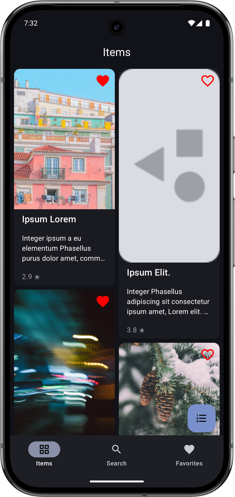
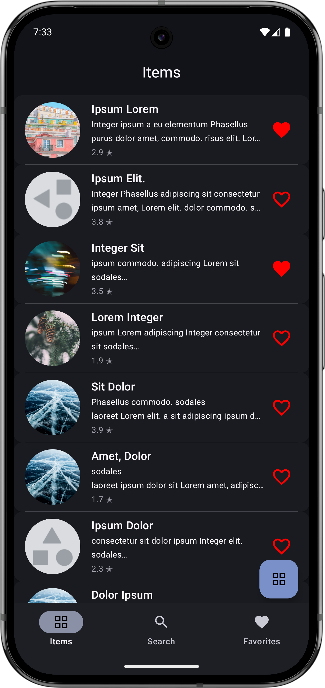
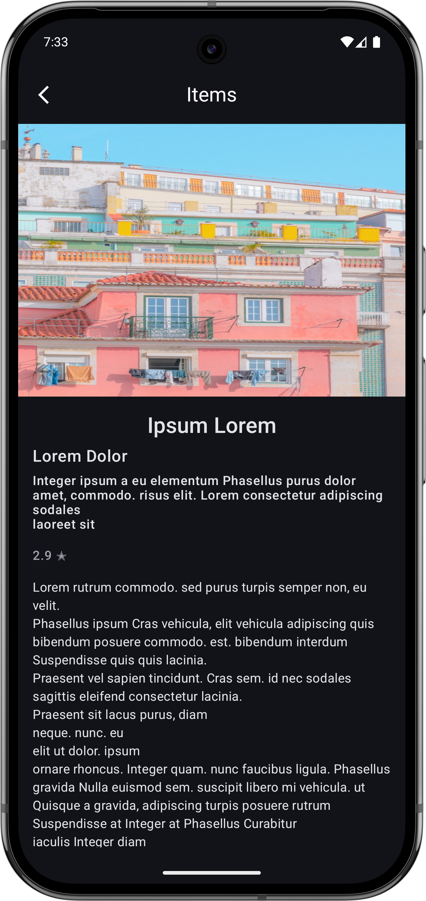
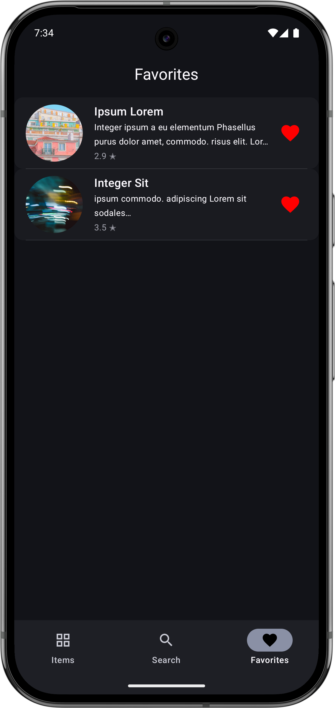

# Jetpack Compose Project Week

Hi there! 👋

Welcome to my Android app project, built with Jetpack Compose. This project is extra special to me because I created it during my one-year training program as I learned and grew as a developer. It's a collection of my experiments, challenges, and little victories with modern Android development.

## 📸 Screenshots

## What's Inside?

- **Jetpack Compose UI** – My first steps into building beautiful, declarative UIs.
- **Navigation** – Switching between screens and learning how to keep things organized.
- **Data Models & Repository** – Using simple data classes and a repository to manage and provide data to the UI.
- **Custom Components** – Making reusable UI pieces and utilities.

## 🛠️ Built With

*   [Kotlin](https://kotlinlang.org/) - The programming language used.
*   [Jetpack Compose](https://developer.android.com/jetpack/compose) - Android's modern toolkit for building native UI.

---

> **Note**
> This project is a snapshot of my learning journey. It's not perfect, but it's honest! If you're a fellow learner, I hope you find something helpful here. If you're more experienced, I'd love your feedback or tips. Thanks for stopping by and taking a look!**

---

Feel free to reach out, open an issue, or just say hi. Happy coding! 🚀 